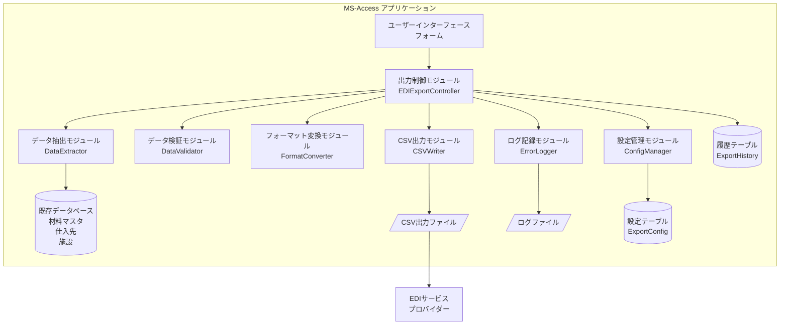

# 設計書（Design Document）
## 機能名: 共通EDI準拠CSV出力機能（edi-csv-export）

## 概要（Overview）

本設計書は、既存のMS-Accessアプリケーションに追加する共通EDI準拠CSV出力機能の詳細設計を定義します。この機能は、MS-Access VBAで実装され、既存のデータベースから発注データを抽出し、共通EDI標準フォーマットに変換してUTF-8エンコーディングのCSVファイルとして出力します。

### 設計目標

1. **既存システムとの統合**: 既存のMS-Accessアプリケーション（common-data-option-chanp.mdb）に最小限の変更で機能を追加
2. **標準準拠**: 共通EDI標準フォーマットに完全準拠したCSV出力
3. **データ整合性**: 出力データの正確性と整合性を保証
4. **エラーハンドリング**: 堅牢なエラー処理とログ記録
5. **ユーザビリティ**: 直感的な操作が可能なユーザーインターフェース
6. **保守性**: 設定変更が容易で、将来の拡張に対応可能な設計

### 技術スタック

- **開発環境**: Microsoft Access 2010以降
- **プログラミング言語**: VBA (Visual Basic for Applications)
- **データベース**: MS-Access MDB形式
- **文字エンコーディング**: UTF-8（出力ファイル）、Shift_JIS（既存データベース）
- **ファイル形式**: CSV（カンマ区切り）

---

## アーキテクチャ（Architecture）

### システム構成図



### レイヤー構造

本システムは以下の3層アーキテクチャで構成されます：

1. **プレゼンテーション層（Presentation Layer）**
   - ユーザーインターフェース（フォーム）
   - ユーザー操作の受付と結果表示

2. **ビジネスロジック層（Business Logic Layer）**
   - データ抽出、検証、変換、出力の制御
   - エラーハンドリングとログ記録
   - 設定管理

3. **データアクセス層（Data Access Layer）**
   - 既存データベースへのアクセス
   - 設定テーブル、履歴テーブルへのアクセス

### モジュール構成

| モジュール名 | 種類 | 責務 |
|------------|------|------|
| frmEDIExport | フォーム | ユーザーインターフェース |
| modEDIExportController | 標準モジュール | 出力処理の全体制御 |
| modDataExtractor | 標準モジュール | データベースからのデータ抽出 |
| modDataValidator | 標準モジュール | データ検証 |
| modFormatConverter | 標準モジュール | EDIフォーマットへの変換 |
| modCSVWriter | 標準モジュール | CSV形式でのファイル出力 |
| modErrorLogger | 標準モジュール | エラーログの記録 |
| modConfigManager | 標準モジュール | 設定情報の管理 |
| clsOrderData | クラスモジュール | 発注データのデータ構造 |
| clsEDIRecord | クラスモジュール | EDIレコードのデータ構造 |

---

## コンポーネントと
インターフェース（Components and Interfaces）

### 1. ユーザーインターフェース（frmEDIExport）

#### フォーム構成

**フォーム名**: frmEDIExport  
**タイトル**: EDI CSV出力

**コントロール一覧**:

| コントロール名 | 種類 | 説明 |
|--------------|------|------|
| btnExport | CommandButton | CSV出力実行ボタン |
| btnOpenFolder | CommandButton | 出力先フォルダを開くボタン |
| btnHistory | CommandButton | 出力履歴表示ボタン |
| btnConfig | CommandButton | 設定画面を開くボタン（管理者のみ） |
| lblStatus | Label | ステータス表示ラベル |
| lblRecordCount | Label | 抽出件数表示ラベル |
| txtProgress | TextBox | 進捗状況表示テキストボックス |
| lstHistory | ListBox | 出力履歴リスト |

#### イベントハンドラ

```vba
' CSV出力ボタンクリック
Private Sub btnExport_Click()
    ' EDIExportControllerを呼び出して出力処理を実行
End Sub

' 出力先フォルダを開くボタンクリック
Private Sub btnOpenFolder_Click()
    ' 設定された出力先フォルダをエクスプローラーで開く
End Sub

' 出力履歴表示ボタンクリック
Private Sub btnHistory_Click()
    ' 出力履歴テーブルから履歴を取得して表示
End Sub

' 設定ボタンクリック
Private Sub btnConfig_Click()
    ' 設定フォームを開く（管理者権限チェック）
End Sub
```

### 2. 出力制御モジュール（modEDIExportController）

#### 主要関数

**ExportEDICSV() As Boolean**
- 説明: CSV出力処理の全体を制御するメイン関数
- 戻り値: 成功時True、失敗時False
- 処理フロー:
  1. 設定情報の読み込み
  2. データ抽出
  3. データ検証
  4. フォーマット変換
  5. CSV出力
  6. 履歴記録
  7. エラーハンドリング

```vba
Public Function ExportEDICSV() As Boolean
    On Error GoTo ErrorHandler
    
    Dim config As Object
    Dim orderData As Collection
    Dim ediRecords As Collection
    Dim outputPath As String
    Dim recordCount As Long
    
    ' 設定読み込み
    Set config = modConfigManager.LoadConfig()
    
    ' データ抽出
    Set orderData = modDataExtractor.ExtractOrderData()
    If orderData.Count = 0 Then
        MsgBox "出力対象のデータがありません。", vbInformation
        ExportEDICSV = False
        Exit Function
    End If
    
    ' データ検証
    If Not modDataValidator.ValidateOrderData(orderData) Then
        MsgBox "データ検証エラーが発生しました。", vbCritical
        ExportEDICSV = False
        Exit Function
    End If
    
    ' フォーマット変換
    Set ediRecords = modFormatConverter.ConvertToEDIFormat(orderData)
    
    ' CSV出力
    outputPath = modCSVWriter.WriteCSV(ediRecords, config)
    If outputPath = "" Then
        MsgBox "CSV出力に失敗しました。", vbCritical
        ExportEDICSV = False
        Exit Function
    End If
    
    ' 履歴記録
    recordCount = ediRecords.Count
    Call SaveExportHistory(outputPath, recordCount)
    
    ' 出力済みフラグ更新
    Call UpdateExportedFlag(orderData)
    
    MsgBox "CSV出力が完了しました。" & vbCrLf & _
           "出力件数: " & recordCount & " 件", vbInformation
    
    ExportEDICSV = True
    Exit Function
    
ErrorHandler:
    modErrorLogger.LogError "ExportEDICSV", Err.Number, Err.Description
    MsgBox "エラーが発生しました: " & Err.Description, vbCritical
    ExportEDICSV = False
End Function
```

### 3. データ抽出モジュール（modDataExtractor）

#### 主要関数

**ExtractOrderData() As Collection**
- 説明: 既存データベースから未送信の発注データを抽出
- 戻り値: clsOrderDataオブジェクトのコレクション

```vba
Public Function ExtractOrderData() As Collection
    On Error GoTo ErrorHandler
    
    Dim db As DAO.Database
    Dim rs As DAO.Recordset
    Dim sql As String
    Dim orderData As Collection
    Dim orderItem As clsOrderData
    
    Set orderData = New Collection
    Set db = CurrentDb()
    
    ' SQL構築: 材料マスタ、仕入先、施設を結合
    sql = "SELECT " & _
          "m.材料CD, m.材料名, m.単価, m.発注単位, m.仕入先CD, " & _
          "s.仕入先名, s.FAX番号, " & _
          "f.施設ID, f.施設名 " & _
          "FROM (材料マスタ AS m " & _
          "INNER JOIN 仕入先 AS s ON m.仕入先CD = s.仕入先ID) " & _
          "INNER JOIN 施設 AS f ON 1=1 " & _
          "WHERE m.発注しない = False " & _
          "AND m.使用あり = True " & _
          "AND m.選択 = True " & _
          "ORDER BY m.材料CD"
    
    Set rs = db.OpenRecordset(sql, dbOpenSnapshot)
    
    Do While Not rs.EOF
        Set orderItem = New clsOrderData
        
        ' データ設定
        orderItem.ItemCode = Nz(rs!材料CD, "")
        orderItem.ItemName = Nz(rs!材料名, "")
        orderItem.UnitPrice = Nz(rs!単価, 0)
        orderItem.OrderUnit = Nz(rs!発注単位, "")
        orderItem.SupplierCode = Nz(rs!仕入先CD, 0)
        orderItem.SupplierName = Nz(rs!仕入先名, "")
        orderItem.FacilityCode = Nz(rs!施設ID, 0)
        orderItem.FacilityName = Nz(rs!施設名, "")
        orderItem.OrderDate = Date
        orderItem.OrderNumber = GenerateOrderNumber()
        
        orderData.Add orderItem
        rs.MoveNext
    Loop
    
    rs.Close
    Set rs = Nothing
    Set db = Nothing
    
    Set ExtractOrderData = orderData
    Exit Function
    
ErrorHandler:
    modErrorLogger.LogError "ExtractOrderData", Err.Number, Err.Description
    Set ExtractOrderData = New Collection
End Function
```

**GenerateOrderNumber() As String**
- 説明: 発注番号を生成（PO + YYYYMMDD + 連番）
- 戻り値: 発注番号文字列

### 4. データ検証モジュール（modDataValidator）

#### 主要関数

**ValidateOrderData(orderData As Collection) As Boolean**
- 説明: 発注データの妥当性を検証
- 引数: orderData - 検証対象の発注データコレクション
- 戻り値: 全て妥当な場合True、エラーがある場合False

```vba
Public Function ValidateOrderData(orderData As Collection) As Boolean
    On Error GoTo ErrorHandler
    
    Dim orderItem As clsOrderData
    Dim errorMessages As String
    Dim isValid As Boolean
    
    isValid = True
    errorMessages = ""
    
    For Each orderItem In orderData
        ' 必須項目チェック
        If Not ValidateRequiredFields(orderItem, errorMessages) Then
            isValid = False
        End If
        
        ' 数値妥当性チェック
        If Not ValidateNumericFields(orderItem, errorMessages) Then
            isValid = False
        End If
        
        ' 日付妥当性チェック
        If Not ValidateDateFields(orderItem, errorMessages) Then
            isValid = False
        End If
        
        ' マスタ存在チェック
        If Not ValidateMasterReference(orderItem, errorMessages) Then
            isValid = False
        End If
    Next orderItem
    
    If Not isValid Then
        modErrorLogger.LogError "ValidateOrderData", 0, errorMessages
        MsgBox "データ検証エラー:" & vbCrLf & errorMessages, vbCritical
    End If
    
    ValidateOrderData = isValid
    Exit Function
    
ErrorHandler:
    modErrorLogger.LogError "ValidateOrderData", Err.Number, Err.Description
    ValidateOrderData = False
End Function
```

**ValidateRequiredFields(orderItem As clsOrderData, ByRef errorMsg As String) As Boolean**
- 説明: 必須項目の存在チェック

**ValidateNumericFields(orderItem As clsOrderData, ByRef errorMsg As String) As Boolean**
- 説明: 数値項目の妥当性チェック

**ValidateDateFields(orderItem As clsOrderData, ByRef errorMsg As String) As Boolean**
- 説明: 日付項目の妥当性チェック

**ValidateMasterReference(orderItem As clsOrderData, ByRef errorMsg As String) As Boolean**
- 説明: マスタデータの参照整合性チェック

### 5. フォーマット変換モジュール（modFormatConverter）

#### 主要関数

**ConvertToEDIFormat(orderData As Collection) As Collection**
- 説明: 発注データを共通EDIフォーマットに変換
- 引数: orderData - 変換元の発注データコレクション
- 戻り値: clsEDIRecordオブジェクトのコレクション

```vba
Public Function ConvertToEDIFormat(orderData As Collection) As Collection
    On Error GoTo ErrorHandler
    
    Dim ediRecords As Collection
    Dim orderItem As clsOrderData
    Dim ediRecord As clsEDIRecord
    
    Set ediRecords = New Collection
    
    For Each orderItem In orderData
        Set ediRecord = New clsEDIRecord
        
        ' EDIフォーマットへの変換
        ediRecord.OrderNumber = FormatString(orderItem.OrderNumber, 20, "L")
        ediRecord.OrderDate = FormatDate(orderItem.OrderDate)
        ediRecord.ItemCode = FormatString(orderItem.ItemCode, 20, "L")
        ediRecord.ItemName = FormatString(orderItem.ItemName, 60, "L")
        ediRecord.Quantity = FormatNumeric(orderItem.Quantity, 10, 2)
        ediRecord.Unit = FormatString(orderItem.OrderUnit, 10, "L")
        ediRecord.UnitPrice = FormatNumeric(orderItem.UnitPrice, 12, 2)
        ediRecord.Amount = FormatNumeric(orderItem.Quantity * orderItem.UnitPrice, 15, 2)
        ediRecord.DeliveryDate = FormatDate(orderItem.DeliveryDate)
        ediRecord.SupplierCode = FormatNumeric(orderItem.SupplierCode, 10, 0)
        ediRecord.SupplierName = FormatString(orderItem.SupplierName, 50, "L")
        ediRecord.FacilityCode = FormatNumeric(orderItem.FacilityCode, 10, 0)
        ediRecord.FacilityName = FormatString(orderItem.FacilityName, 50, "L")
        
        ediRecords.Add ediRecord
    Next orderItem
    
    Set ConvertToEDIFormat = ediRecords
    Exit Function
    
ErrorHandler:
    modErrorLogger.LogError "ConvertToEDIFormat", Err.Number, Err.Description
    Set ConvertToEDIFormat = New Collection
End Function
```

**FormatDate(dateValue As Date) As String**
- 説明: 日付をYYYYMMDD形式に変換
- 引数: dateValue - 変換元の日付
- 戻り値: YYYYMMDD形式の文字列

```vba
Public Function FormatDate(dateValue As Date) As String
    FormatDate = Format(dateValue, "yyyymmdd")
End Function
```

**FormatNumeric(numValue As Variant, length As Integer, decimals As Integer) As String**
- 説明: 数値を右詰めゼロ埋め形式に変換
- 引数: 
  - numValue - 変換元の数値
  - length - 全体の桁数
  - decimals - 小数点以下の桁数
- 戻り値: フォーマット済み文字列

```vba
Public Function FormatNumeric(numValue As Variant, length As Integer, decimals As Integer) As String
    Dim formatStr As String
    Dim result As String
    
    If decimals > 0 Then
        formatStr = String(length - decimals - 1, "0") & "." & String(decimals, "0")
    Else
        formatStr = String(length, "0")
    End If
    
    result = Format(numValue, formatStr)
    FormatNumeric = Right(Space(length) & result, length)
End Function
```

**FormatString(strValue As String, length As Integer, align As String) As String**
- 説明: 文字列を左詰めスペース埋め形式に変換
- 引数:
  - strValue - 変換元の文字列
  - length - 全体の文字数
  - align - 配置（"L":左詰め、"R":右詰め）
- 戻り値: フォーマット済み文字列

```vba
Public Function FormatString(strValue As String, length As Integer, align As String) As String
    Dim result As String
    
    ' 文字数制限を適用
    If Len(strValue) > length Then
        result = Left(strValue, length)
    Else
        result = strValue
    End If
    
    ' 配置に応じてスペース埋め
    If align = "L" Then
        result = result & Space(length - Len(result))
    Else
        result = Space(length - Len(result)) & result
    End If
    
    FormatString = result
End Function
```

### 6. CSV出力モジュール（modCSVWriter）

#### 主要関数

**WriteCSV(ediRecords As Collection, config As Object) As String**
- 説明: EDIレコードをCSV形式でファイルに出力
- 引数:
  - ediRecords - 出力するEDIレコードのコレクション
  - config - 設定情報オブジェクト
- 戻り値: 出力ファイルのフルパス（失敗時は空文字列）

```vba
Public Function WriteCSV(ediRecords As Collection, config As Object) As String
    On Error GoTo ErrorHandler
    
    Dim outputPath As String
    Dim fileName As String
    Dim fileNum As Integer
    Dim ediRecord As clsEDIRecord
    Dim csvLine As String
    Dim recordCount As Long
    
    ' ファイル名生成
    fileName = "PO_" & Format(Now, "yyyymmdd_hhnnss") & ".csv"
    outputPath = config.OutputFolder & "\" & fileName
    
    ' 同名ファイルが存在する場合は連番を付加
    outputPath = GetUniqueFilePath(outputPath)
    
    ' ファイルオープン（UTF-8で出力）
    fileNum = FreeFile
    Open outputPath For Output As #fileNum
    
    ' BOM出力（UTF-8）
    Print #fileNum, Chr(&HEF) & Chr(&HBB) & Chr(&HBF);
    
    ' ヘッダー行出力
    csvLine = BuildHeaderLine()
    Print #fileNum, csvLine
    
    ' データ行出力
    recordCount = 0
    For Each ediRecord In ediRecords
        csvLine = BuildDataLine(ediRecord)
        Print #fileNum, csvLine
        recordCount = recordCount + 1
    Next ediRecord
    
    Close #fileNum
    
    ' 整合性検証
    If Not VerifyCSVIntegrity(outputPath, ediRecords.Count) Then
        Kill outputPath
        WriteCSV = ""
        Exit Function
    End If
    
    ' ファイル属性確認（読み取り専用でないこと）
    If (GetAttr(outputPath) And vbReadOnly) = vbReadOnly Then
        SetAttr outputPath, vbNormal
    End If
    
    WriteCSV = outputPath
    Exit Function
    
ErrorHandler:
    If fileNum > 0 Then Close #fileNum
    modErrorLogger.LogError "WriteCSV", Err.Number, Err.Description & " - " & outputPath
    WriteCSV = ""
End Function
```

**BuildHeaderLine() As String**
- 説明: CSVヘッダー行を構築

**BuildDataLine(ediRecord As clsEDIRecord) As String**
- 説明: CSVデータ行を構築

**GetUniqueFilePath(basePath As String) As String**
- 説明: 一意なファイルパスを生成（同名ファイルがある場合は連番を付加）

**VerifyCSVIntegrity(filePath As String, expectedCount As Long) As Boolean**
- 説明: 出力されたCSVファイルの整合性を検証

### 7. エラーログモジュール（modErrorLogger）

#### 主要関数

**LogError(moduleName As String, errorNumber As Long, errorDescription As String)**
- 説明: エラー情報をログファイルに記録
- 引数:
  - moduleName - エラーが発生したモジュール名
  - errorNumber - エラー番号
  - errorDescription - エラー説明

```vba
Public Sub LogError(moduleName As String, errorNumber As Long, errorDescription As String)
    On Error Resume Next
    
    Dim logPath As String
    Dim logFileName As String
    Dim fileNum As Integer
    Dim logEntry As String
    Dim config As Object
    
    ' 設定から
ログ出力先取得
    Set config = modConfigManager.LoadConfig()
    logPath = config.LogFolder
    
    ' ログファイル名生成（日付別）
    logFileName = "EDIExport_" & Format(Date, "yyyymmdd") & ".log"
    logPath = logPath & "\" & logFileName
    
    ' ログエントリ構築
    logEntry = Format(Now, "yyyy-mm-dd hh:nn:ss") & " | " & _
               "ERROR | " & _
               moduleName & " | " & _
               "Err#" & errorNumber & " | " & _
               errorDescription
    
    ' ログファイルに追記
    fileNum = FreeFile
    Open logPath For Append As #fileNum
    Print #fileNum, logEntry
    Close #fileNum
End Sub
```

**LogInfo(moduleName As String, message As String)**
- 説明: 情報ログを記録

**LogWarning(moduleName As String, message As String)**
- 説明: 警告ログを記録

### 8. 設定管理モジュール（modConfigManager）

#### 主要関数

**LoadConfig() As Object**
- 説明: 設定テーブルから設定情報を読み込む
- 戻り値: 設定情報を格納したDictionaryオブジェクト

```vba
Public Function LoadConfig() As Object
    On Error GoTo ErrorHandler
    
    Dim db As DAO.Database
    Dim rs As DAO.Recordset
    Dim config As Object
    
    Set config = CreateObject("Scripting.Dictionary")
    Set db = CurrentDb()
    
    ' 設定テーブルから読み込み
    Set rs = db.OpenRecordset("SELECT * FROM ExportConfig", dbOpenSnapshot)
    
    If Not rs.EOF Then
        config("OutputFolder") = Nz(rs!OutputFolder, "C:\EDI_Output")
        config("LogFolder") = Nz(rs!LogFolder, "C:\EDI_Logs")
        config("Encoding") = Nz(rs!Encoding, "UTF-8")
        config("Delimiter") = Nz(rs!Delimiter, ",")
        config("IncludeHeader") = Nz(rs!IncludeHeader, True)
    Else
        ' デフォルト設定を使用
        config("OutputFolder") = "C:\EDI_Output"
        config("LogFolder") = "C:\EDI_Logs"
        config("Encoding") = "UTF-8"
        config("Delimiter") = ","
        config("IncludeHeader") = True
    End If
    
    rs.Close
    Set rs = Nothing
    Set db = Nothing
    
    Set LoadConfig = config
    Exit Function
    
ErrorHandler:
    ' エラー時はデフォルト設定を返す
    Set config = CreateObject("Scripting.Dictionary")
    config("OutputFolder") = "C:\EDI_Output"
    config("LogFolder") = "C:\EDI_Logs"
    config("Encoding") = "UTF-8"
    config("Delimiter") = ","
    config("IncludeHeader") = True
    Set LoadConfig = config
End Function
```

**SaveConfig(config As Object) As Boolean**
- 説明: 設定情報を設定テーブルに保存

---

## データモデル（Data Models）

### クラス定義

#### clsOrderData（発注データクラス）

発注データの構造を定義するクラス

```vba
' クラスモジュール: clsOrderData
Option Compare Database
Option Explicit

' プロパティ
Private m_OrderNumber As String
Private m_OrderDate As Date
Private m_ItemCode As String
Private m_ItemName As String
Private m_Quantity As Double
Private m_OrderUnit As String
Private m_UnitPrice As Currency
Private m_DeliveryDate As Date
Private m_SupplierCode As Long
Private m_SupplierName As String
Private m_FacilityCode As Long
Private m_FacilityName As String

' プロパティアクセサ
Public Property Get OrderNumber() As String
    OrderNumber = m_OrderNumber
End Property

Public Property Let OrderNumber(value As String)
    m_OrderNumber = value
End Property

Public Property Get OrderDate() As Date
    OrderDate = m_OrderDate
End Property

Public Property Let OrderDate(value As Date)
    m_OrderDate = value
End Property

' ... 他のプロパティも同様に定義 ...

' メソッド
Public Function IsValid() As Boolean
    ' 必須項目のチェック
    IsValid = (Len(m_ItemCode) > 0) And _
              (Len(m_ItemName) > 0) And _
              (m_Quantity > 0) And _
              (m_UnitPrice >= 0)
End Function
```

#### clsEDIRecord（EDIレコードクラス）

共通EDIフォーマットのレコード構造を定義するクラス

```vba
' クラスモジュール: clsEDIRecord
Option Compare Database
Option Explicit

' プロパティ（全てString型でフォーマット済み）
Private m_OrderNumber As String      ' 20桁
Private m_OrderDate As String        ' 8桁 YYYYMMDD
Private m_ItemCode As String         ' 20桁
Private m_ItemName As String         ' 60桁
Private m_Quantity As String         ' 10桁（小数点以下2桁）
Private m_Unit As String             ' 10桁
Private m_UnitPrice As String        ' 12桁（小数点以下2桁）
Private m_Amount As String           ' 15桁（小数点以下2桁）
Private m_DeliveryDate As String     ' 8桁 YYYYMMDD
Private m_SupplierCode As String     ' 10桁
Private m_SupplierName As String     ' 50桁
Private m_FacilityCode As String     ' 10桁
Private m_FacilityName As String     ' 50桁

' プロパティアクセサ（省略）

' メソッド
Public Function ToCSVLine() As String
    ' CSV行を構築
    ToCSVLine = m_OrderNumber & "," & _
                m_OrderDate & "," & _
                m_ItemCode & "," & _
                """" & m_ItemName & """," & _
                m_Quantity & "," & _
                m_Unit & "," & _
                m_UnitPrice & "," & _
                m_Amount & "," & _
                m_DeliveryDate & "," & _
                m_SupplierCode & "," & _
                """" & m_SupplierName & """," & _
                m_FacilityCode & "," & _
                """" & m_FacilityName & """"
End Function
```

### データベーステーブル定義

#### ExportConfig（設定テーブル）

CSV出力の設定情報を管理するテーブル

| フィールド名 | データ型 | サイズ | 説明 | デフォルト値 |
|------------|---------|-------|------|------------|
| ConfigID | AutoNumber | 4 | 設定ID（主キー） | - |
| OutputFolder | Text | 255 | 出力先フォルダパス | C:\EDI_Output |
| LogFolder | Text | 255 | ログ出力先フォルダパス | C:\EDI_Logs |
| Encoding | Text | 20 | 文字エンコーディング | UTF-8 |
| Delimiter | Text | 1 | CSV区切り文字 | , |
| IncludeHeader | Boolean | 1 | ヘッダー行出力フラグ | True |
| UpdateDate | DateTime | 8 | 最終更新日時 | Now() |
| UpdateUser | Text | 50 | 最終更新ユーザー | CurrentUser() |

**制約**:
- Primary Key: ConfigID
- 通常は1レコードのみ存在

**DDL（テーブル作成SQL）**:
```sql
CREATE TABLE ExportConfig (
    ConfigID AUTOINCREMENT PRIMARY KEY,
    OutputFolder TEXT(255) DEFAULT 'C:\EDI_Output',
    LogFolder TEXT(255) DEFAULT 'C:\EDI_Logs',
    Encoding TEXT(20) DEFAULT 'UTF-8',
    Delimiter TEXT(1) DEFAULT ',',
    IncludeHeader YESNO DEFAULT True,
    UpdateDate DATETIME DEFAULT Now(),
    UpdateUser TEXT(50) DEFAULT CurrentUser()
);
```

#### ExportHistory（出力履歴テーブル）

CSV出力の履歴を記録するテーブル

| フィールド名 | データ型 | サイズ | 説明 |
|------------|---------|-------|------|
| ExportID | AutoNumber | 4 | 出力ID（主キー） |
| ExportDate | DateTime | 8 | 出力日時 |
| ExportUser | Text | 50 | 出力ユーザー |
| OutputFileName | Text | 255 | 出力ファイル名 |
| OutputFilePath | Text | 255 | 出力ファイルフルパス |
| RecordCount | Long | 4 | 出力レコード件数 |
| Status | Text | 20 | ステータス（Success/Error） |
| ErrorMessage | Memo | - | エラーメッセージ（エラー時） |

**制約**:
- Primary Key: ExportID
- Index: ExportDate

**DDL（テーブル作成SQL）**:
```sql
CREATE TABLE ExportHistory (
    ExportID AUTOINCREMENT PRIMARY KEY,
    ExportDate DATETIME NOT NULL,
    ExportUser TEXT(50) NOT NULL,
    OutputFileName TEXT(255) NOT NULL,
    OutputFilePath TEXT(255) NOT NULL,
    RecordCount LONG NOT NULL,
    Status TEXT(20) NOT NULL,
    ErrorMessage MEMO
);

CREATE INDEX idx_ExportDate ON ExportHistory(ExportDate);
```

### 共通EDI CSVフォーマット仕様

#### ヘッダー行

```
発注番号,発注日,品目コード,品名,数量,単位,単価,金額,納期,仕入先コード,仕入先名,配送先コード,配送先名
```

#### データ行フォーマット

| 項目名 | 桁数 | 形式 | 説明 | 例 |
|-------|------|------|------|-----|
| 発注番号 | 20 | 左詰めスペース埋め | PO + YYYYMMDD + 連番 | PO20240115001 |
| 発注日 | 8 | YYYYMMDD | 発注日 | 20240115 |
| 品目コード | 20 | 左詰めスペース埋め | 材料CD | M001 |
| 品名 | 60 | 左詰めスペース埋め | 材料名 | 白菜 |
| 数量 | 10 | 右詰めゼロ埋め（小数2桁） | 発注数量 | 0000010.50 |
| 単位 | 10 | 左詰めスペース埋め | 発注単位 | kg |
| 単価 | 12 | 右詰めゼロ埋め（小数2桁） | 仕入単価 | 00000150.00 |
| 金額 | 15 | 右詰めゼロ埋め（小数2桁） | 数量×単価 | 000000001575.00 |
| 納期 | 8 | YYYYMMDD | 納品希望日 | 20240117 |
| 仕入先コード | 10 | 右詰めゼロ埋め | 仕入先ID | 0000000123 |
| 仕入先名 | 50 | 左詰めスペース埋め | 仕入先名称 | ○○食品株式会社 |
| 配送先コード | 10 | 右詰めゼロ埋め | 施設ID | 0000000001 |
| 配送先名 | 50 | 左詰めスペース埋め | 施設名称 | ○○保育園 |

#### サンプルCSV

```csv
発注番号,発注日,品目コード,品名,数量,単位,単価,金額,納期,仕入先コード,仕入先名,配送先コード,配送先名
PO20240115001       ,20240115,M001                ,"白菜                                                        ",0000010.50,kg        ,00000150.00 ,000000001575.00,20240117,0000000123,"○○食品株式会社                                      ",0000000001,"○○保育園                                          "
PO20240115002       ,20240115,M002                ,"人参                                                        ",0000005.00,kg        ,00000200.00 ,000000001000.00,20240117,0000000123,"○○食品株式会社                                      ",0000000001,"○○保育園                                          "
```

---

## 正確性プロパティ（Correctness Properties）

プロパティ（property）とは、システムの全ての有効な実行において真であるべき特性や動作のことです。本質的には、システムが何をすべきかについての形式的な記述です。プロパティは、人間が読める仕様と機械で検証可能な正確性保証との橋渡しとなります。

以下のプロパティは、要件定義書の受入基準から導出され、プロパティベーステスト（Property-Based Testing）によって検証されます。

### プロパティ 1: 未送信データの完全抽出

任意のデータベース状態において、データ抽出処理を実行した場合、抽出結果には「発注しない = False」かつ「使用あり = True」かつ「選択 = True」の条件を満たす全てのレコードが含まれ、それ以外のレコードは含まれない。

**検証要件: 要件 1.1**

### プロパティ 2: 抽出データの必須フィールド完全性

任意の抽出された発注データレコードにおいて、発注番号、発注日、品目コード、数量、単価、納期の全ての必須フィールドが存在し、NULL値でない。

**検証要件: 要件 1.2, 1.4**

### プロパティ 3: EDIフォーマット変換の正確性

任意の発注データに対して、EDIフォーマットへの変換を実行した場合、以下の全ての条件を満たす：
- 日付フィールドはYYYYMMDD形式（8桁）に変換される
- 数値フィールドは指定桁数の右詰めゼロ埋め形式に変換される
- 文字列フィールドは指定桁数の左詰めスペース埋め形式に変換される
- 各フィールドの文字数は共通EDI仕様の制限を超えない

**検証要件: 要件 2.1, 2.2, 2.3, 2.4, 2.6**

### プロパティ 4: CSV形式の準拠性

任意のEDIレコードコレクションに対して、CSV出力を実行した場合、出力ファイルは以下の全ての条件を満たす：
- 文字エンコーディングがUTF-8である
- 区切り文字がカンマである
- 1行目がヘッダー行である
- 各データ行の項目数がヘッダー行の項目数と一致する

**検証要件: 要件 3.1, 3.2, 3.3, 3.4, 10.2**

### プロパティ 5: 出力ファイル名の形式準拠

任意のCSV出力操作において、生成されるファイル名は「PO_YYYYMMDD_HHMMSS.csv」の形式に準拠し、タイムスタンプによって一意性が保証される。

**検証要件: 要件 3.5, 9.2**

### プロパティ 6: 設定値の正確な取得

任意の設定項目（出力先フォルダ、ログフォルダ、文字エンコーディング）に対して、設定テーブルに保存された値を取得した場合、保存時の値と同一の値が取得される（ラウンドトリップ特性）。

**検証要件: 要件 3.7, 8.1, 8.2, 8.3, 8.4**

### プロパティ 7: データ検証の完全性

任意の発注データに対して、データ検証を実行した場合、以下の全ての検証が実施される：
- 必須項目の存在検証
- 数値項目の数値妥当性検証
- 日付項目の日付妥当性検証
- 品目コードのマスタ参照整合性検証

検証エラーが1つでも存在する場合、検証結果はFalseとなる。

**検証要件: 要件 4.1, 4.2, 4.3, 4.4**

### プロパティ 8: 出力履歴の完全記録

任意の成功したCSV出力操作において、出力履歴テーブルに以下の全ての情報が記録される：
- 出力日時
- 出力ユーザー
- 出力ファイル名
- 出力ファイルパス
- 出力レコード件数
- 一意の出力ID

**検証要件: 要件 5.1, 5.3**

### プロパティ 9: 出力済みフラグの更新

任意の成功したCSV出力操作において、出力された全ての発注データレコードに対して出力済みフラグが設定され、次回の抽出時には抽出対象外となる。

**検証要件: 要件 5.2**

### プロパティ 10: ログエントリの必須フィールド完全性

任意のログ出力操作において、ログファイルに記録される各エントリには、日時、エラーレベル、モジュール名、エラーメッセージの全ての必須フィールドが含まれる。

**検証要件: 要件 6.4**

### プロパティ 11: ログファイルの日付別生成

任意のログ出力操作において、ログファイル名は「EDIExport_YYYYMMDD.log」の形式で生成され、同一日付の全てのログエントリは同一ファイルに記録される。

**検証要件: 要件 6.5**

### プロパティ 12: 出力ファイルの配置正確性

任意のCSV出力操作において、出力されたファイルは設定で指定された出力先フォルダに配置され、ファイル属性は読み取り専用でない。

**検証要件: 要件 9.1, 9.3**

### プロパティ 13: データ整合性の保証

任意のCSV出力操作において、出力前のデータベースレコード件数と出力後のCSVファイルのデータ行数（ヘッダー行を除く）が一致する。

**検証要件: 要件 10.1**

### プロパティ 14: ラウンドトリップ特性

任意の発注データに対して、以下の操作を実行した場合、元のデータと同等のデータ構造が得られる：
1. 発注データをEDIフォーマットに変換
2. EDIレコードをCSV形式で出力
3. CSVファイルを読み込んでEDIレコードに変換
4. EDIレコードを発注データ形式に逆変換

この特性により、データ変換とシリアライゼーションの正確性が保証される。

**検証要件: 要件 10.5**

---

## エラーハンドリング（Error Handling）

### エラー分類

本システムでは、エラーを以下の3つのレベルに分類します：

1. **致命的エラー（Critical Error）**: システムの継続実行が不可能なエラー
2. **エラー（Error）**: 処理の失敗を示すが、システムは継続可能なエラー
3. **警告（Warning）**: 処理は成功したが、注意が必要な状況

### エラーハンドリング戦略

#### 1. データ抽出エラー

**発生条件**:
- データベース接続エラー
- SQLエラー
- テーブルが存在しない

**処理**:
```vba
On Error GoTo ErrorHandler
' データ抽出処理
Exit Function

ErrorHandler:
    modErrorLogger.LogError "ExtractOrderData", Err.Number, Err.Description
    MsgBox "データ抽出中にエラーが発生しました。" & vbCrLf & _
           "詳細: " & Err.Description, vbCritical, "エラー"
    ' 空のコレクションを返す
    Set ExtractOrderData = New Collection
```

#### 2. データ検証エラー

**発生条件**:
- 必須項目の欠落
- 数値項目の不正な値
- 日付項目の不正な値
- マスタ参照の不整合

**処理**:
- エラー内容と該当レコード情報をログに記録
- ユーザーにエラーメッセージを表示
- 出力処理を中止

```vba
If Not ValidateOrderData(orderData) Then
    modErrorLogger.LogError "ValidateOrderData", 0, "データ検証エラー"
    MsgBox "データ検証エラーが発生しました。" & vbCrLf & _
           "ログファイルを確認してください。", vbCritical, "エラー"
    Exit Function
End If
```

#### 3. ファイル出力エラー

**発生条件**:
- ディスクフル
- 書き込み権限なし
- パスが存在しない
- ファイルが他のプロセスで使用中

**処理**:
```vba
On Error GoTo ErrorHandler
' ファイル出力処理
Exit Function

ErrorHandler:
    If fileNum > 0 Then Close #fileNum
    modErrorLogger.LogError "WriteCSV", Err.Number, _
                           Err.Description & " - " & outputPath
    MsgBox "ファイル出力中にエラーが発生しました。" & vbCrLf & _
           "出力先: " & outputPath & vbCrLf & _
           "詳細: " & Err.Description, vbCritical, "エラー"
    WriteCSV = ""
```

#### 4. ログ記録エラー

**発生条件**:
- ログフォルダが存在しない
- ログファイルへの書き込み権限なし

**処理**:
- エラーを無視してシステムを継続（On Error Resume Next）
- ユーザーにメッセージボックスで通知

```vba
Public Sub LogError(moduleName As String, errorNumber As Long, errorDescription As String)
    On Error Resume Next
    ' ログ記録処理
    ' エラーが発生しても処理を継続
End Sub
```

### エラーメッセージ設計

#### ユーザー向けメッセージ

- 簡潔で分かりやすい日本語
- 具体的な対処方法を含める
- 技術的な詳細は最小限に

**例**:
```
データ抽出中にエラーが発生しました。
データベース接続を確認してください。

詳細: テーブル '材料マスタ' が見つかりません。
```

#### ログ向けメッセージ

- 詳細な技術情報を含める
- エラー番号、モジュール名、スタックトレース
- 再現に必要な情報

**例**:
```
2024-01-15 10:30:45 | ERROR | ExtractOrderData | Err#3078 | テーブル '材料マスタ' が見つかりません。
```

### エラーリカバリー

#### 自動リカバリー

1. **設定の欠落**: デフォルト設定を使用
2. **一時的なファイルロック**: リトライ処理（最大3回）
3. **ファイル名の衝突**: 連番を付加して再試行

#### 手動リカバリー

1. **データ検証エラー**: ユーザーがデータを修正後、再実行
2. **権限エラー**: 管理者が権限を付与後、再実行
3. **ディスクフル**: ディスク容量を確保後、再実行

---

## テスト戦略（Testing Strategy）

### テストアプローチ

本システムのテストは、以下の2つの補完的なアプローチを組み合わせて実施します：

1. **ユニットテスト（Unit Tests）**: 特定の例、エッジケース、エラー条件を検証
2. **プロパティベーステスト（Property-Based Tests）**: 全ての入力に対する普遍的なプロパティを検証

両方のテストアプローチが必要です。ユニットテストは具体的なバグを捕捉し、プロパティベーステストは一般的な正確性を検証します。

### ユニットテスト

#### テスト対象

ユニットテストは以下に焦点を当てます：

1. **特定の例**: 正常系の代表的なケース
2. **エッジケース**: 境界値、空データ、NULL値
3. **エラー条件**: 異常系の動作確認
4. **統合ポイント**: コンポーネント間の連携

#### テストケース例

**modDataExtractor.ExtractOrderData**:
- 正常系: 発注対象データが存在する場合
- エッジケース: 発注対象データが0件の場合
- エッジケース: 必須項目がNULLのレコードが含まれる場合
- エラー系: テーブルが存在しない場合

**modFormatConverter.FormatDate**:
- 正常系: 有効な日付（2024/01/15 → "20240115"）
- エッジケース: 月末日付（2024/02/29 → "20240229"）
- エッジケース: 年始日付（2024/01/01 → "20240101"）

**modFormatConverter.FormatNumeric**:
- 正常系: 正の数値（150.5, 12, 2 → "00000150.50"）
- エッジケース: ゼロ（0, 10, 2 → "0000000.00"）
- エッジケース: 小数点以下が長い数値（123.456789, 10, 2 → "0000123.46"）

**modCSVWriter.WriteCSV**:
- 正常系: 複数レコードの出力
- エッジケース: 1レコードのみの出力
- エッジケース: 同名ファイルが既に存在する場合
- エラー系: 出力先フォルダが存在しない場合
- エラー系: 書き込み権限がない場合

### プロパティベーステスト

#### テストライブラリ

VBAにはプロパティベーステストの標準ライブラリが存在しないため、以下のアプローチを採用します：

1. **カスタムテストフレームワーク**: 簡易的なプロパティテストフレームワークを実装
2. **ランダムデータ生成**: テストデータジェネレーターを実装
3. **反復実行**: 各プロパティテストを最低100回実行

#### テスト設定

各プロパティテストは以下の設定で実行します：

- **反復回数**: 100回（ランダム化による網羅性確保のため）
- **タグ形式**: `' Feature: edi-csv-export, Property {番号}: {プロパティ説明}`
- **失敗時**: 失敗したテストケースの入力値をログに記録

#### プロパティテスト実装例

**プロパティ 3: EDIフォーマット変換の正確性**

```vba
' Feature: edi-csv-export, Property 3: EDIフォーマット変換の正確性
Public Sub TestProperty3_EDIFormatConversion()
    Dim i As Long
    Dim orderData As Collection
    Dim ediRecords As Collection
    Dim orderItem As clsOrderData
    Dim ediRecord As clsEDIRecord
    Dim testPassed As Boolean
    
    testPassed = True
    
    ' 100回反復実行
    For i = 1 To 100
        ' ランダムな発注データ生成
        Set orderData = GenerateRandomOrderData()
        
        ' EDIフォーマットに変換
        Set ediRecords = modFormatConverter.ConvertToEDIFormat(orderData)
        
        ' プロパティ検証
        For Each ediRecord In ediRecords
            ' 日付がYYYYMMDD形式（8桁）
            If Len(ediRecord.OrderDate) <> 8 Or Not IsNumeric(ediRecord.OrderDate) Then
                Debug.Print "Property 3 failed: Invalid date format - " & ediRecord.OrderDate
                testPassed = False
            End If
            
            ' 数値が右詰めゼロ埋め
            If Not IsValidNumericFormat(ediRecord.Quantity, 10, 2) Then
                Debug.Print "Property 3 failed: Invalid numeric format - " & ediRecord.Quantity
                testPassed = False
            End If
            
            ' 文字列が左詰めスペース埋め
            If Len(ediRecord.ItemName) <> 60 Then
                Debug.Print "Property 3 failed: Invalid string length - " & Len(ediRecord.ItemName)
                testPassed = False
            End If
        Next ediRecord
    Next i
    
    If testPassed Then
        Debug.Print "Property 3: PASSED (100 iterations)"
    Else
        Debug.Print "Property 3: FAILED"
    End If
End Sub
```

**プロパティ 14: ラウンドトリップ特性**

```vba
' Feature: edi-csv-export, Property 14: ラウンドトリップ特性
Public Sub TestProperty14_RoundTrip()
    Dim i As Long
    Dim originalData As Collection
    Dim ediRecords As Collection
    Dim csvPath As String
    Dim reconstructedData As Collection
    Dim testPassed As Boolean
    
    testPassed = True
    
    ' 100回反復実行
    For i = 1 To 100
        ' ランダムな発注データ生成
        Set originalData = GenerateRandomOrderData()
        
        ' EDI変換 → CSV出力 → CSV読込 → データ再構築
        Set ediRecords = modFormatConverter.ConvertToEDIFormat(originalData)
        csvPath = modCSVWriter.WriteCSV(ediRecords, LoadConfig())
        Set reconstructedData = modCSVReader.ReadCSV(csvPath)
        
        ' 元のデータと再構築データが同等か検証
        If Not AreCollectionsEquivalent(originalData, reconstructedData) Then
            Debug.Print "Property 14 failed: Round-trip data mismatch"
            testPassed = False
        End If
        
        ' テスト用ファイル削除
        Kill csvPath
    Next i
    
    If testPassed Then
        Debug.Print "Property 14: PASSED (100 iterations)"
    Else
        Debug.Print "Property 14: FAILED"
    End If
End Sub
```

### テストデータ生成

#### ランダムデータジェネレーター

```vba
' ランダムな発注データコレクションを生成
Public Function GenerateRandomOrderData() As Collection
    Dim orderData As Collection
    Dim orderItem As clsOrderData
    Dim recordCount As Long
    Dim i As Long
    
    Set orderData = New Collection
    
    ' 1〜50件のランダムなレコード数
    recordCount = Int((50 - 1 + 1) * Rnd + 1)
    
    For i = 1 To recordCount
        Set orderItem = New clsOrderData
        
        orderItem.ItemCode = "M" & Format(Int(Rnd * 9999) + 1, "0000")
        orderItem.ItemName = GenerateRandomString(10, 30)
        orderItem.Quantity = Round(Rnd * 100, 2)
        orderItem.OrderUnit = Choose(Int(Rnd * 5) + 1, "kg", "g", "個", "本", "袋")
        orderItem.UnitPrice = Round(Rnd * 1000, 2)
        orderItem.OrderDate = DateAdd("d", -Int(Rnd * 30), Date)
        orderItem.DeliveryDate = DateAdd("d", Int(Rnd * 7) + 1, orderItem.OrderDate)
        orderItem.SupplierCode = Int(Rnd * 999) + 1
        orderItem.SupplierName = GenerateRandomString(10, 30) & "株式会社"
        orderItem.FacilityCode = Int(Rnd * 99) + 1
        orderItem.FacilityName = GenerateRandomString(5, 15) & "施設"
        
        orderData.Add orderItem
    Next i
    
    Set GenerateRandomOrderData = orderData
End Function

' ランダムな文字列を生成
Private Function GenerateRandomString(minLen As Long, maxLen As Long) As String
    Dim length As Long
    Dim i As Long
    Dim result As String
    Dim chars As String
    
    chars = "あいうえおかきくけこさしすせそたちつてとなにぬねのはひふへほまみむめもやゆよらりるれろわをん"
    length = Int((maxLen - minLen + 1) * Rnd + minLen)
    
    For i = 1 To length
        result = result & Mid(chars, Int(Rnd * Len(chars)) + 1, 1)
    Next i
    
    GenerateRandomString = result
End Function
```

### テスト実行環境

#### 前提条件

- Microsoft Access 2010以降
- テスト用データベース（本番データのコピー）
- テスト用出力フォルダ（書き込み権限あり）

#### テスト実行手順

1. テスト用データベースを準備
2. テストモジュール（modTestRunner）を実行
3. テスト結果をイミディエイトウィンドウで確認
4. 失敗したテストのログを分析
5. 必要に応じてコードを修正し、再テスト

### テストカバレッジ目標

- **ユニットテスト**: 全ての公開関数をカバー
- **プロパティベーステスト**: 全ての正確性プロパティをカバー
- **統合テスト**: エンドツーエンドの出力処理をカバー

---

## 実装ガイドライン（Implementation Guidelines）

### 開発順序

以下の順序で実装することを推奨します：

1. **フェーズ1: 基盤構築**
   - データベーステーブル作成（ExportConfig, ExportHistory）
   - クラスモジュール作成（clsOrderData, clsEDIRecord）
   - 設定管理モジュール（modConfigManager）
   - ログ記録モジュール（modErrorLogger）

2. **フェーズ2: コア機能実装**
   - データ抽出モジュール（modDataExtractor）
   - データ検証モジュール（modDataValidator）
   - フォーマット変換モジュール（modFormatConverter）
   - CSV出力モジュール（modCSVWriter）

3. **フェーズ3: 制御層実装**
   - 出力制御モジュール（modEDIExportController）
   - エラーハンドリングの統合

4. **フェーズ4: UI実装**
   - フォーム作成（frmEDIExport）
   - イベントハンドラ実装
   - 進捗表示機能

5. **フェーズ5: テスト実装**
   - ユニットテスト作成
   - プロパティベーステスト作成
   - テストデータジェネレーター作成

### コーディング規約

#### 命名規則

- **モジュール**: `mod` + 機能名（例: modDataExtractor）
- **クラス**: `cls` + クラス名（例: clsOrderData）
- **フォーム**: `frm` + フォーム名（例: frmEDIExport）
- **関数**: パスカルケース（例: ExtractOrderData）
- **変数**: キャメルケース（例: orderData）
- **定数**: 全て大文字 + アンダースコア（例: MAX_RETRY_COUNT）

#### エラーハンドリング

全ての公開関数に以下のパターンを適用：

```vba
Public Function FunctionName() As ReturnType
    On Error GoTo ErrorHandler
    
    ' 処理本体
    
    Exit Function
    
ErrorHandler:
    modErrorLogger.LogError "FunctionName", Err.Number, Err.Description
    ' エラー時の戻り値設定
End Function
```

#### コメント

- 各関数の先頭に目的と引数、戻り値を記述
- 複雑なロジックには説明コメントを追加
- TODOコメントは `' TODO: 説明` の形式で記述

```vba
'==============================================================================
' 関数名: ExtractOrderData
' 目的: 既存データベースから未送信の発注データを抽出
' 引数: なし
' 戻り値: clsOrderDataオブジェクトのコレクション
' 作成日: 2024-01-15
' 作成者: [開発者名]
'==============================================================================
Public Function ExtractOrderData() As Collection
    ' 実装
End Function
```

### パフォーマンス考慮事項

#### データベースアクセス最適化

1. **レコードセットタイプ**: 読み取り専用の場合は `dbOpenSnapshot` を使用
2. **インデックス活用**: WHERE句で使用するフィールドにインデックスを作成
3. **結合の最適化**: 必要なフィールドのみをSELECT句に指定

```vba
' 良い例: 必要なフィールドのみ取得
sql = "SELECT 材料CD, 材料名, 単価 FROM 材料マスタ WHERE 発注しない = False"

' 悪い例: 全フィールド取得
sql = "SELECT * FROM 材料マスタ WHERE 発注しない = False"
```

#### ファイルI/O最適化

1. **バッファリング**: 複数行をメモリに蓄積してから一括書き込み
2. **ファイルハンドル管理**: 使用後は必ずCloseする
3. **大量データ処理**: 進捗表示でユーザーに状況を通知

```vba
' バッファリングの例
Dim buffer As String
Dim bufferSize As Long
bufferSize = 0

For Each ediRecord In ediRecords
    buffer = buffer & ediRecord.ToCSVLine() & vbCrLf
    bufferSize = bufferSize + 1
    
    ' 100行ごとに書き込み
    If bufferSize >= 100 Then
        Print #fileNum, buffer;
        buffer = ""
        bufferSize = 0
    End If
Next ediRecord

' 残りを書き込み
If bufferSize > 0 Then
    Print #fileNum, buffer;
End If
```

### セキュリティ考慮事項

#### SQLインジェクション対策

パラメータ化クエリを使用（VBAではDAO.QueryDefを使用）：

```vba
Dim qdf As DAO.QueryDef
Set qdf = db.CreateQueryDef("")
qdf.SQL = "SELECT * FROM 材料マスタ WHERE 材料CD = [pItemCode]"
qdf.Parameters("pItemCode") = itemCode
Set rs = qdf.OpenRecordset()
```

#### ファイルパス検証

ユーザー入力のパスは必ず検証：

```vba
Public Function IsValidPath(path As String) As Boolean
    ' パストラバーサル攻撃を防ぐ
    If InStr(path, "..") > 0 Then
        IsValidPath = False
        Exit Function
    End If
    
    ' 絶対パスのみ許可
    If Not (Mid(path, 2, 1) = ":" Or Left(path, 2) = "\\") Then
        IsValidPath = False
        Exit Function
    End If
    
    IsValidPath = True
End Function
```

#### 権限管理

管理者機能へのアクセス制御：

```vba
Public Function IsAdministrator() As Boolean
    ' Windowsユーザーグループをチェック
    ' または、Access内の権限テーブルをチェック
    IsAdministrator = (CurrentUser() = "Admin")
End Function

Private Sub btnConfig_Click()
    If Not IsAdministrator() Then
        MsgBox "この機能は管理者のみ使用できます。", vbExclamation
        Exit Sub
    End If
    
    DoCmd.OpenForm "frmConfig"
End Sub
```

### 保守性向上のための設計

#### 設定の外部化

ハードコードを避け、設定テーブルで管理：

```vba
' 悪い例
Const OUTPUT_FOLDER As String = "C:\EDI_Output"

' 良い例
Dim config As Object
Set config = modConfigManager.LoadConfig()
outputFolder = config("OutputFolder")
```

#### マジックナンバーの排除

定数を使用：

```vba
' 定数定義
Public Const EDI_ITEM_CODE_LENGTH As Integer = 20
Public Const EDI_ITEM_NAME_LENGTH As Integer = 60
Public Const EDI_DATE_FORMAT As String = "yyyymmdd"

' 使用例
ediRecord.ItemCode = FormatString(orderItem.ItemCode, EDI_ITEM_CODE_LENGTH, "L")
```

#### ログレベルの活用

```vba
Public Enum LogLevel
    llInfo = 1
    llWarning = 2
    llError = 3
End Enum

Public Sub Log(level As LogLevel, moduleName As String, message As String)
    Dim levelStr As String
    
    Select Case level
        Case llInfo: levelStr = "INFO"
        Case llWarning: levelStr = "WARNING"
        Case llError: levelStr = "ERROR"
    End Select
    
    ' ログ記録処理
End Sub
```

### デプロイメント

#### 配布パッケージ

1. **MDBファイル**: 機能を実装したAccessデータベース
2. **セットアップスクリプト**: テーブル作成、初期設定を行うVBAマクロ
3. **ユーザーマニュアル**: 操作手順書（PDF）
4. **管理者マニュアル**: 設定変更、トラブルシューティング手順書（PDF）

#### インストール手順

1. 既存のAccessデータベースをバックアップ
2. 新しいモジュールとフォームをインポート
3. セットアップスクリプトを実行してテーブルを作成
4. 初期設定（出力先フォルダ、ログフォルダ）を入力
5. テストデータで動作確認

#### バージョン管理

```vba
' バージョン情報を定数で管理
Public Const APP_VERSION As String = "1.0.0"
Public Const APP_BUILD_DATE As String = "2024-01-15"

' フォームに表示
Me.lblVersion.Caption = "Version " & APP_VERSION
```

### トラブルシューティング

#### よくある問題と対処法

**問題1: UTF-8で出力されない**
- 原因: VBAの標準ファイル出力はShift_JIS
- 対処: ADODBストリームを使用してUTF-8で出力

```vba
' UTF-8出力の実装例
Dim stream As Object
Set stream = CreateObject("ADODB.Stream")
stream.Type = 2 ' adTypeText
stream.Charset = "UTF-8"
stream.Open
stream.WriteText csvContent, 0 ' adWriteChar
stream.SaveToFile outputPath, 2 ' adSaveCreateOverWrite
stream.Close
```

**問題2: 大量データ処理時のメモリ不足**
- 原因: 全データをメモリに保持
- 対処: ストリーミング処理に変更

**問題3: 日付フォーマットが環境依存**
- 原因: Format関数がシステムロケールに依存
- 対処: 明示的なフォーマット指定

```vba
' 環境に依存しない日付フォーマット
Public Function FormatDate(dateValue As Date) As String
    FormatDate = Format(Year(dateValue), "0000") & _
                 Format(Month(dateValue), "00") & _
                 Format(Day(dateValue), "00")
End Function
```

---

## 将来の拡張性（Future Extensibility）

### 想定される拡張機能

1. **複数EDIフォーマット対応**
   - フォーマット定義を外部ファイル（XML/JSON）で管理
   - フォーマット変換エンジンの抽象化

2. **自動送信機能**
   - FTP/SFTP経由でサービスプロバイダーに自動送信
   - スケジュール実行機能

3. **受信データの取り込み**
   - サプライヤーからの返信データ（納期回答、出荷通知）の取り込み
   - 双方向EDI対応

4. **データ変換ルールのカスタマイズ**
   - ユーザーが変換ルールを定義できるUI
   - 計算式のカスタマイズ

5. **監査ログ機能**
   - 全ての操作履歴を記録
   - データ変更の追跡

### 拡張を容易にする設計

#### インターフェースの抽象化

```vba
' フォーマット変換インターフェース（将来の拡張用）
Public Function ConvertToFormat(orderData As Collection, formatType As String) As Collection
    Select Case formatType
        Case "EDI_COMMON"
            Set ConvertToFormat = ConvertToEDIFormat(orderData)
        Case "EDI_CUSTOM"
            Set ConvertToFormat = ConvertToCustomFormat(orderData)
        Case Else
            ' デフォルトフォーマット
            Set ConvertToFormat = ConvertToEDIFormat(orderData)
    End Select
End Function
```

#### プラグイン機構

```vba
' カスタム変換ルールの読み込み（将来の拡張用）
Public Function LoadCustomRules() As Collection
    ' XMLファイルから変換ルールを読み込む
    ' ユーザー定義の計算式を適用
End Function
```

---

## 付録（Appendix）

### A. 共通EDI標準フォーマット詳細仕様

（本設計書では簡略化した仕様を記載していますが、実際の実装時には正式な共通EDI標準仕様書を参照してください）

### B. VBAコーディングベストプラクティス

1. Option Explicitを必ず使用
2. 変数のスコープは最小限に
3. マジックナンバーを避ける
4. エラーハンドリングを必ず実装
5. リソースは必ず解放（Close, Set Nothing）

### C. 参考資料

- Microsoft Access VBA リファレンス
- 共通EDI標準仕様書
- VBAパフォーマンスチューニングガイド

### D. 用語集

| 用語 | 説明 |
|------|------|
| EDI | Electronic Data Interchange（電子データ交換） |
| CSV | Comma-Separated Values（カンマ区切り値） |
| UTF-8 | Unicode Transformation Format 8-bit |
| VBA | Visual Basic for Applications |
| DAO | Data Access Objects |
| プロパティベーステスト | ランダムな入力に対して普遍的な性質を検証するテスト手法 |
| ラウンドトリップ | データを変換して元に戻した時に同じ値になる性質 |

---

## 変更履歴（Change History）

| バージョン | 日付 | 変更者 | 変更内容 |
|----------|------|--------|---------|
| 1.0.0 | 2024-01-15 | [作成者] | 初版作成 |

---

## 承認（Approval）

| 役割 | 氏名 | 承認日 | 署名 |
|------|------|--------|------|
| 設計者 | | | |
| レビュアー | | | |
| 承認者 | | | |

